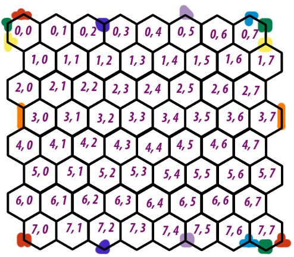
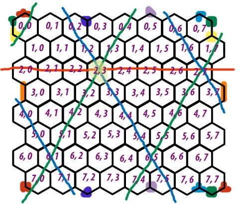

# Симуляция движения робота по гексагональной поверхности

## Оглавление
[Описание](#1)
* [Идея](#2)
* [Реализация](#3)

[Математика](#4)
* [Рабочее пространство](#5)
* [Датчики](#6)
* [Движение](#7)

[«И спросила кроха...»](#8)
* [В начале был Шестиугольник](#9)
* [Как поедем?](#10)
* [Какой цвет?](#11)
* [Где сугроб?](#12)
* [Куда везти?](#13)
* [Что нам стоит…](#14)
* [P. S.](#15)

[Настройка и запуск](#16)  
[Бонус](#17)  
[Библиографический список](#18)   
[Приложение](#19)  

</br>

<a id="1"></a>
## **Описание**
<a id="2"></a>
### Идея
Робот, перемещающийся в 2-D мире. Он умеет воспринимать цвет под собой (3 цвета), а также определять находится ли перед ним преграда – сугроб. Робот начинает движение из случайного места, и должен довезти груз в определённую точку.

2-D мир – квадратная гексагональная поверхность со стороной в 8 ячеек, замкнутая со всех сторон – своего рода гекса-сетка на торе. На рисунке 1 она представлена с нанесённой координатной сеткой.

  
*Рис. 1 – Развёртка 2-D мира.*

Соответствующими цветами отмечены места «сшивания» сетки, т.е., например, ячейка (0;0) соединена с ячейками (7;0), (0;1), (1;0), (1;7), (0;7), (7;7).

У робота есть датчик цвета, с помощью которого он может определять цвет ячейки, на которой он находится в данный момент, – зелёный, красный или жёлтый. Датчик неидеальный, робот может получать также и ложную информацию, причём разные цвета он определяет с разным успехом (подробнее в разделе «[Математика](#4)»). 

У робота есть датчик препятствий, с помощью которого он может определять наличие сугроба перед собой – для оператора это ячейки белого цвета. В такие ячейки робот заехать не может. Считается, что датчик идеальный.

Роботу можно задать начальную ячейку, а можно случайно поместить его на поверхность. Он всегда случайно выбирает направление движения (одно из шести возможных, т.к. всегда смежных ячеек 6), проверяет нет ли в этом направлении (в этой ячейке) сугроба (если есть, то снова случайно выбирает направление – до тех пор, пока оно не окажется свободным), и перемещается на 1 ячейку в этом направлении (робот всегда перемещается не более чем на одну ячейку за один раз). Затем, робот определяет цвет под собой, обновляет матрицу вероятностей своей навигационной системы, и выбирает следующее направление движения. Так продолжается до тех пор, пока робот не доедет до конечной ячейки – её координаты сохранены в навигационной системе, а её цвет уникальный для поверхности – жёлтый. Одна из используемых карт поверхности представлена на рисунке 2.

  
*Рис. 2 – Карта «Greenland 2».*

У робота есть аккумулятор, заряда которого хватает на проезд строго определённого количества ячеек (по умолчанию 1000) – может случится и так, что робот не сможет добраться до конечной ячейки.

Роботом можно управлять вручную – конкретно задавать последовательность направлений движения. В таком режиме работы оператору следует быть внимательным, чтобы робот не заехал в сугроб.
<a id="3"></a>
### Реализация
После задания всех параметров (подробнее о них в следующих разделах), запуска и выполнении программы пользователь может посмотреть матрицу (гексатрицу J) вероятностей после каждого действия робота (выбора направления, сенса перед собой, переезда, сенса под собой), а также комментарии к каждому действию (какое направление сенсил, нашёл ли там сугроб, куда в итоге поехал, какой цвет под собой обнаружил) (пример на рисунке 3). Можно следить, совпадает ли реальное положение с предполагаемым системой управления робота; из каких ячеек робот выбирает своё положение (в случае, если есть несколько максимальных вероятностей).

  
*Рис. 3 – Промежуточные данные симуляции.*

Когда робот заканчивает движение, выводится общая информация о данной симуляции (рис. 4).

  
*Рис. 4 – Общая информация.*

Помимо печатаемых данных, выводятся два графика: зависимость системы навигации и зависимость величины максимальной предполагаемой вероятности от времени (рис. 5). Слева представлены «сырые» данные, а справа фильтрованные медианным и скользящим фильтрами и нормализованные от 0 до 100.

  
*Рис. 5 – Графики.*

Для неподготовленного зрителя было разработано приложение «Simulation», позволяющая отслеживать реальное (слева) и вероятностные (справа) положения робота на каждом его перемещении – фактически робот всегда есть в каждой ячейке с какой-то вероятностью, но чем она больше, тем темнее робот. Положение, которое система навигации считает наиболее вероятным отмечено синей меткой. 

Скорость движения робота можно настроить в программе.

Рабочее окно приложения представлено на рисунке 6.

  
*Рис. 6 – Рабочее окно приложения.*

Можно запустить симуляцию (кнопка «START»), остановить (кнопка «STOP»), вернуть в начало (кнопка «RESET»). По ползунку «PROGRESS» можно отслеживать прогресс в процентах, а также задавать конкретное состояние симуляции, перемещая ползунок. Кнопка «RELOAD» актуализирует данные симуляции – подгружает последние данные.

Было разработано 4 разных карты без сугробов: 'Mainland', 'Greenland', 'Redland', 'Chessland', и 4 их копи, но с сугробами, представленных на рисунках ниже.

|||
| - | - |
|||
|||
|||

</br>

<a id="4"></a>
## **Математика**
<a id="5"></a>
### Рабочее пространство
Так как поверхность представлена гекса-сеткой, в ней отсутствуют привычные (как в квадратной сетке) направления движения. Вместо них есть 3 направления – по горизонтали и по двум диагоналям (почему так и можно ли по-другому – в разделе «[И спросила кроха…](#8)»). Учитывая, что поверхность замкнута, получим траектории движения – рисунок 7.

  
*Рис. 7 – Траектории движения.*

Здесь движение идёт из (2;3). По горизонтали – красная линия, по диагонали\_1 (примем её как «положительную») – зелёная, по диагонали\_2 (примем её как «отрицательную») – синяя. Аналогично для каждой ячейки поверхности. Диагоналей каждого типа 4 штуки – ~~половина от того, на что я рассчитывал~~ половина стороны поверхности, а их длина равна 16 – удвоенной стороне поверхности. 

<a id="6"></a>
### Датчики
Рассмотрим датчик цвета. Он неидеальный, и его неидеальность зависит от двух параметров-вероятностей: 

- вероятность того, что считываемый цвет действительно тот, который должен считаться с данной ячейки; 
- вероятность верного определения цвета, если считывается соответствующий цвет (тот, который должен считаться с данной ячейки).

Представим ситуацию: робот приехал в ячейку A, которая окрашена в красный цвет. Первая вероятность (p\_color) определяет, что на сенсор датчика поступит красный цвет, а вторая (p\_red) – то, что датчик «поймёт», что этот цвет – красный. Фактически, вторая вероятность – это апостериорная вероятность – вероятность определения красного цвета, при условии, что реальный цвет – красный (самое время для теоремы Байеса, но её не будет, так как нам попросту нечего считать – мы сами конкретно задаем обе вероятности). 

Логично, что если бы было 2 цвета, то апостериорная вероятность для второго (зелёного) цвета была бы равна 1 - p\_red, но у нас 3 цвета, то есть (снова в случае реальной красной ячейки) 1 – p\_red должна как-то «распределиться» между определением зелёного и жёлтого. Обратимся к физике и вспомним, как выглядит спектр видимого цвета (рис. 8).

  
*Рис. 8 – Спектр видимого света.*

Видно, что жёлтый цвет ближе к зелёному, чем к красному. Т.е. датчику легче  ошибиться  выбирая  между  зелёным  и  жёлтым, чем  между жёлтым и красным.

Значит, вероятность 1 - p\_red из примера нужно пропорционально распределить между определением зелёного и желтого. Можно просто домножать её на коэффициент, например, на 1/3 для случая определения зелёного и 2/3 – для желтого, так как зелёный дальше от красного, чем жёлтый, т.е. если датчик и ошибётся (с красным), то он скорее выберет жёлтый, чем зелёный. Аналогично определение остальных цветов. Влияние первой вероятности (p\_color) не используется напрямую в расчётах, но об этом – в разделе «[И спросила кроха…](#8)».

Рассмотрим датчик расстояния. Известно, что не бывает идеальных датчиков, однако если использовать одновременно несколько одинаковых датчиков, то вероятность ошибки сильно падает. В данном роботе цена ошибки въезда в сугроб довольно высока (доставляет ценные грузы!), так что мы просто используем систему из кучи одинаковых несовершенных датчиков расстояния, чтобы робот ~~почти~~ точно никогда не ошибся. Поэтому в данной симуляции считается, что датчик расстояния идеальный.

<a id="7"></a>
### Движение
Роботу нужно поехать в выбранном направлении. Но он может с некоторой вероятностью:
- остаться на месте – пробуксовать (0.15);
- поехать назад – переклинило в мозгах от ЭМИ (0.05);
- свернуть влево или вправо (на 1 ячейку) – кривые колёса наехали на кочку (0.1).

По существу, робот двигается сразу во всех возможных направлениях, но с разной вероятностью. На рисунке 9 представлен образец такого движения, при заданных выше вероятностях. Направление желаемого движения указано стрелкой. Подробная математика описана в разделе «[И спросила кроха…](#8)».


||</br></br>|
| :-: | :-: |

*Рис. 9 – Образец матрицы вероятностей при движении.*

Как робот понимает, где находится? У него (его системы навигации) всегда перед глазами матрица вероятностей. В какой ячейке вероятность наибольшая – там он и есть. Если же наибольших вероятностей несколько, то случайным образом выбирается любая из них. Причём, если наибольшая вероятность неотличима от медианы всех вероятностей (разность между ней и медианой меньше допуска [задаётся в программе как prob\_tolerance]), то робот выбирает наибольшую вероятность среди тех, которые окружали его предыдущее положение (по его мнению) – эдакая защита от чрезмерной ошибки – в случае полнейшей неопределённости робот может изменить своё наиболее вероятное положение не более чем на 1 ячейку.

</br>

<a id="8"></a>
## **«И спросила кроха...»**
<a id="9"></a>
### В начале был Шестиугольник
В отличие от квадратной сетки, где модель движения не зависит от направления (оно одинаково по направлениям вверх-вниз-влево-вправо и по диагоналям), в гексагональной сетке нет привычного понятия движения вверх-вниз (при данной ориентации поверхности – рис. 1) – двигаясь строго вверх робот окажется между ячеек. Сложность в том, что для работы нужно гекса-сетку представлять в виде таблицы – двумерного массива данных.

Существует множество подходов представления шестиугольников в сетку[1]. Один из них на рисунке 10 – понравился нам больше всего. 

|||
| :-: | :-: |

*Рис. 10 – Один из способов перехода между сетками.*

Однако эти способы (и наш фаворит в том числе) подразумевают использование неочевидных методов, сложных математических приёмов и всякого прочего от чего глаза на лоб лезут (особенно если речь идёт о замкнутой сетке, как в нашем случае). Поэтому было принято решение разработать собственный метод перехода из гексагональной сетки в квадратную.

<a id="10"></a>
### Как поедем?
Прежде всего была выбрана система координат (рис. 1). Фактически она соответствует обычной двумерной таблице, в которой каждая нечётная (отсчёт идёт с 0) строка смещена вправо. 

Для удобства введём численные обозначения для каждого направления движения (рис. 11). 

  
*Рис. 11 – Нумерация движений.*

Здесь движение идёт из (2;3): вверх-вправо – 1, вправо – 2, вниз-вправо – 3, вниз-влево – 4, влево – 5, вверх-влево – 6. Условимся, что робот движется положительно вправо (1, 2, 3) и отрицательно влево (4, 5, 6). 

Для понимания принципа вычисления вероятностей рассмотрим движение без вероятностных поворотов. Вероятность нахождения робота в каждой ячейке траектории складывается из трёх вероятностей: приезда в неё из предыдущей (робот ехал вперёд), приезда в неё из неё же (робот остался, где был), приезда в неё из последующей (робот поехал назад) – схема представлена на рисунке 12.

  
*Рис. 12 – Схема вычисления вероятности в ячейке.*

Такую операцию нужно проделать для каждой ячейкой траектории, по которой едет робот. 

То есть, мы, зная направление движения робота и его текущее реальное положение, должны определить траекторию, по которой он собирается ехать, а затем применить указанную операцию для каждой ячейки траектории. Звучит несложно? Так и есть, до тех пор, пока мы не доберёмся до диагоналей…

По сути, для них всё то же самое, только нужно вывести уравнение движения по данной диагонали. На рисунке 13 представлены все возможные положительные диагонали (диагонали\_1) в переводе на квадратную сетку.

|||
| :-: | :-: |  

*Рис. 13 – Переход в квадратную сетку.*

Заметна некоторая закономерность в отображении диагоналей. Не без труда было выведено условие (реализация на Python), которое позволяет найти все клетки в таблице данной диагонали, зная текущую ячейку.
```python
for i in range(height):
    for j in range(width):
        if j == (real\_pos[1] + i // 2 - real\_pos[0] // 2) % 8 or \
                j == (real\_pos[1] + i // 2 + 4 - real\_pos[0] // 2) % 8:
```

где height и width – высота и ширина таблицы соответственно, real\_pos[] – список, содержащий координаты текущей ячейки, число 8 обозначает длину стороны гекса-сетки, а 4 – расстояние между «витками» диагонали (или количество диагоналей, как больше нравится).

Аналогично и для отрицательных диагоналей (диагоналей_2), с поправкой на их противоположное направление:


А теперь вспоминаем, что робот может ещё и повернуть! 

По существу, ничего существенно не меняется, только теперь мы должны применить операцию вычисления вероятностей для каждой из всех траекторий движения из данной ячейки, с поправкой на то, что вероятности движения по «побочным» траекториям (по тем, на которые робот может свернуть) должны умножаться на вероятность поворота робота (0.1 из примера выше и рисунка 9), а по основной – на (1 - 2\*0.1). 

Вычисляя значения на траекториях «в лоб» друг за другом, исходная ячейка (пересечение всех траекторий) примет некорректное значение – она будет каждый раз перезаписываться исходя из данных текущей траектории. Так что значение в ней следует изменять в самую последнюю очередь (оно равно сумме вероятностей остаться в текущей ячейке для каждой траектории).

<a id="11"></a>
### Какой цвет?
В разделе «[Математика](#4)» описан принцип действия датчика цвета. Рассказано про апостериорную вероятность и особенность для трёх цветов. Ниже представлен алгоритм, изменяющий матрицу вероятностей после работы датчика.
```python
for i in range(height):
    for j in range(width):
        under\_col = world\_clear[i][j]
        if under\_col == 0:
            if color == 0:
                new\_probability[i].append(prob[i][j] \* p\_green)
            elif color == 1:
                new\_probability[i].append(
                    prob[i][j] \* (1 - p\_green) \* ratio)
            elif color == 3:
                new\_probability[i].append(
                    prob[i][j] \* (1 - p\_green) \* (1 - ratio))
        elif under\_col == 1:
            if color == 0:
                new\_probability[i].append(prob[i][j] \* (1 - p\_red) \* ratio)
            elif color == 1:
                new\_probability[i].append(prob[i][j] \* p\_red)
            elif color == 3:
                new\_probability[i].append(
                    prob[i][j] \* (1 - p\_red) \* (1 - ratio))
        elif under\_col == 3:
            if color == 0:
                new\_probability[i].append(
                    prob[i][j] \* (1 - p\_yellow) \* (1 - ratio))
            elif color == 1:
                new\_probability[i].append(
                    prob[i][j] \* (1 - p\_yellow) \* ratio)
            elif color == 3:
                new\_probability[i].append(prob[i][j] \* p\_yellow)
```

Объясним, что происходит. Условимся, что 0 – зеленый, 1 – красный, 3 – жёлтый. Действительный цвет, который сейчас под роботом, – under\_col (берём его из карты, зная текущее реальное положение робота), а color – цвет, который попал на датчик. Таким образом, описаны все возможные варианты определения цвета – по логике из раздела «[Математика](#_Математика)». Вероятность в каждой ячейке поверхности равна произведению её текущей вероятности и вероятности того или иного варианта определения цвета. Здесь p\_green, p\_red, p\_yellow – апостериорные вероятности верного определения соответствующих цветов, а ratio – тот самый коэффициент, учитывающий «близость» жёлтого к зелёному, и «отдалённость» жёлтого от красного. 

Но как учитывается вероятность p\_color? Принимая во внимание, что мы сами (как разработчики симуляции) определяем, какой цвет реально подан на датчик, было принято решение реализовать влияние p\_color через генератор псевдослучайных чисел. Генератор выдаёт какое-то число (от 0 до 1) каждый раз, когда color задаётся (здесь поясним, что по умолчанию color равна under\_col – так мы моделируем процесс верного считывания цвета), и если это число больше (или равно) p\_color, то с color ничего не происходит, и она остаётся равной реальному цвету под роботом, но если меньше, то color случайным образом меняется на другой цвет. 

*P. S. На самом деле в программе используется не p\_color, а 1 - p\_color, и логика работы становится обратной. Просто удобнее объяснять на вероятности «успеха» – верного считывания.*

Таким образом, помимо того, что датчик сам по себе никогда не может точно определить цвет, он ещё может получить и ложную информацию о реальном цвете.

И, конечно, значения в полученной матрице вероятностей нормализуются.

<a id="12"></a>
### Где сугроб?
Было сказано, что датчик препятствий считается идеальным. Это существенно упрощает жизнь. 

Когда робот обнаруживает перед собой сугроб, на матрице вероятностей данная ячейка обнуляется («там же сугроб, значит меня там точно нет»), а значение вероятности, которые было в этой ячейке, равномерно распределяется по всем остальным ячейкам (делённое на 63 прибавляется в каждую ячейку, кроме обнулённой). 

Важно понимать, что обнуляется ячейка относительно предсказываемого положения робота, а не реального, но информация для датчика берётся, исходя из реального положения.

К слову, робот не обладает долгосрочной памятью на сугробы, так что в обнулённую ячейку вполне может потом что-то записаться.

Сейчас у читателя должен возникнуть вопрос: если из-за сугроба вероятность обнуляется, то не испортит ли это алгоритм формирования матрицы вероятностей после сенса цвета? Вовсе нет! Все карты, на которых есть сугробы являются копиями обычных – бесснежных – карт, где в каждой ячейке известен цвет и нет никаких белых пятен. Поэтому данные для датчика цвета всегда берутся из «чистой» карты, а данные для датчика расстояния – из снежной.

Можно сказать, что сначала мы выпустили робота на обычную карту – чтобы поездил туда-сюда, всё изучил. А потом выпускаем его в реальные условия с кучей сугробов или любых других подходящих препятствий.

<a id="13"></a>
### Куда везти?
	Конечная цель движения робота – жёлтая ячейка, координаты которой известны навигационной системе. Но нельзя просто так взять и, засенсив под собой жёлтый цвет, определить, что ты приехал. А если датчик ошибся? Для этого и нужны точные координат конечного пункта. Но как быть, если по матрице вероятностей видно, что робот приехал, но датчик не видит под собой жёлтый цвет? Для решения этой проблемы было разработано условие, по которому робот определяет действительно ли он доехал. Но сначала введём два определения.

Максимальная вероятность – это наибольшая вероятность в матрице вероятностей в данный момент (находится в той ячейке, в которой, как считает робот, он находится). 

Предсказанные координаты (положение) – координаты ячейки, в которой, как считает робот, он находится.

Само условие: *робот считает, что цвет жёлтый, и максимальная вероятность больше 0.2 и предсказанные координаты совпадают с координатами конечной ячейки ИЛИ робот считает, что цвет не жёлтый, и максимальная вероятность больше 0.8 и координаты совпадают с координатами конечной ячейки, то робот находится в конечной ячейке.*

Суть в том, что недостаточная информация о положении компенсируется достаточной информацией о цвете и наоборот.

<a id="14"></a>
### Что нам стоит…
В один момент нам стало мало выводимой информации о каждом шаге робота – тогда была добавлена общая информация о симуляции при завершении работы. Нам стало мало и её – так появились графики ошибки и максимальной вероятности. Но и этого стало мало – родилась идея визуализировать весь процесс симуляции. 

Для этих целей был выбран язык Processing и одноимённая среда разработки. После каждого завершения основной программы («main»), данные о выбранной карте, реальных и предсказанных положениях (матрицы вероятностей) записываются в соответствующие файлы, которые подгружаются в программе «Simulation». На их основе рисуется положение робота в каждый конкретный момент времени. Причём в случае предсказанного положения рисуются сразу все возможные положения робота, но с разной прозрачностью: чем больше вероятность нахождения робота в данной ячейке, тем ниже прозрачность (зависимость логарифмическая – с линейной совсем не наглядно). Синяя метка обозначает то положение, где, как считает робот, он находится. 

Программа была сконвертирована в одноимённое приложение, которое работает независимо от основной программы.

<a id="15"></a>
### P. S. 
Нельзя не отметить полуфабрикат графического интерфейса («window.ui»), который всем хорош, кроме того, что не работает.  

  
Его так и не удалось помирить с Python.  
Гипотетический желающий повторить результат, если разгадаешь все тайны ошибки 0xC0000409, — пиши, не стесняйся: [github.com/Injenus/Robot_Move_Simulation](https://github.com/Injenus/Robot_Move_Simulation). 

</br>

<a id="16"></a>
## **Настройка и запуск**
Перед запуском симуляции нужно настроить все параметры – задать желаемые значения переменным:

- UNDETERMINED\_START – если Истина, то робот начнёт движение из случайной ячейки (если Ложь, то движения начнётся из по умолчанию заданных координат для данной карты);
- RANDOM\_MOVE – если Истина, то робот будет двигаться автономно, случайно выбирая направления движения (если Ложь, то необходимо будет задать последовательность поворотов);
- WORLD\_NUMBER – номер карты (соответствующий номер в списке maps);
- path – список последовательности направлений движений, задаётся числами от 1 до 6 (в соответствии с рис. 11);
- p\_red, p\_green, p\_yellow – апостериорные вероятности определения цвета соответствующих цветов;
- ratio – коэффициент, чем он меньше, тем «ближе» жёлтый цвет к зелёному;
- p\_back, p\_stay, p\_turn – вероятности отъезда назад, оставания на месте и поворота в какую-либо сторону соответственно;
- color\_error\_prob – вероятность ошибки считываемого цвета (известная нам величина 1 - p\_color);
- prob\_tolerance – допуск вероятности («[Движение](#7)»);
- limit\_step – на проезд скольких ячеек хватит аккумулятора робота;
- fps, speed\_koef – определяют видимую скорость движения робота в приложение – целочисленное отношение fps и speed\_koef (fps – частота обновления изображения в приложении, не рекомендуется ставить больше 16).

</br>

<a id="17"></a>
## **Бонус**
Для тех, кто дочитал до конца – бонусная карта «Boxland» в подарок!  
Просто задайте WORLD\_NUMBER любое число, кроме 0..7 (номеров стандартных карт) и получите уникальный опыт симуляции!

<a id="18"></a>
## **Библиографический список**
1. habr.com [Электронный ресурс] – электронные текстовые данные URL: [https://habr.com](https://habr.com/ru/post/319644/)

</br>

<a id="19"></a>
## **Приложение**
Исходный код программы – «main.py».  
Исходный код приложения – «Simulation.pde».  
Пользовательский интерфейс – «window.ui».  
